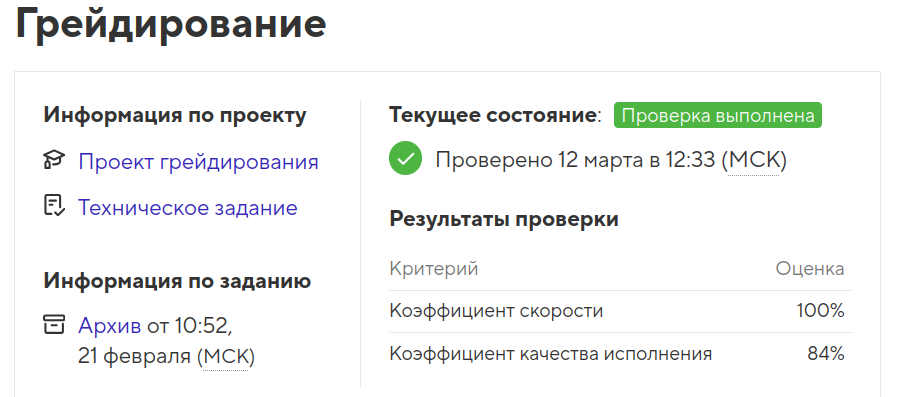

# Проект Drink2Go

Репозиторий создан для грейдирования на профессиональном онлайн‑курсе   «[Производство. Фронтенд-разработчика](https://up.htmlacademy.ru/production-frontender/20)» от [HTML Academy](https://htmlacademy.ru).

<h4>Курс пройден в 2025 году</h4>

  

- Студент: [Виктория Калугина](https://up.htmlacademy.ru/javascript-individual/2/user/1788421).
- Проект: [Drink2Go](https://toryatoria.github.io/1788421-keksobooking-1/)

---

## Описание
